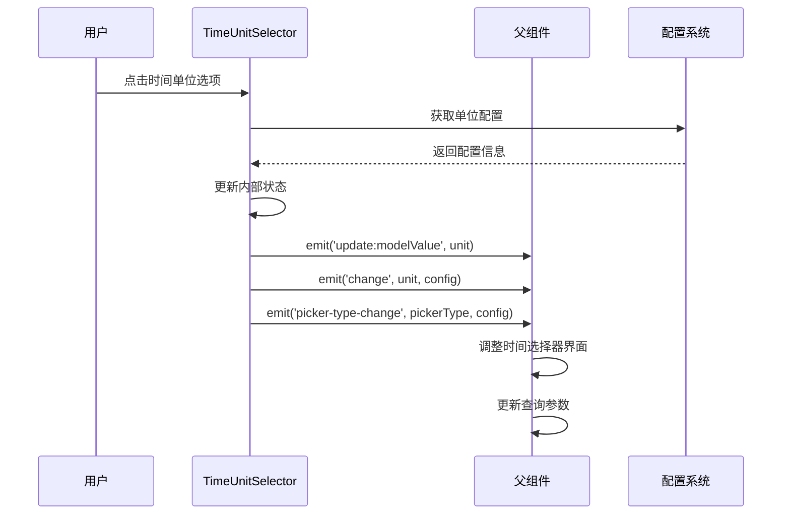
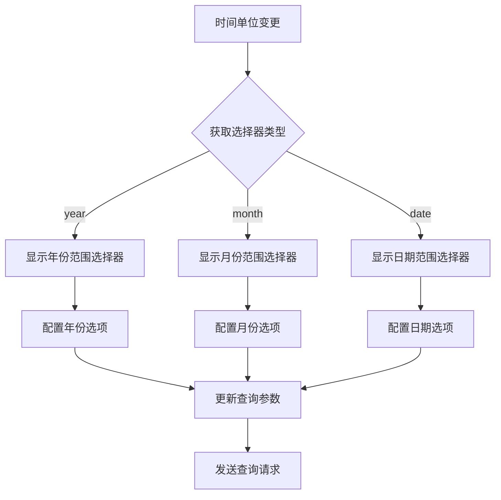

# TimeUnitSelector 时间单位选择器组件

## 概述

TimeUnitSelector 是时间选择功能改进项目中的核心组件之一，负责提供年、月、日三种时间度量单位的选择界面。该组件基于统一使用 UPD 字段的技术架构，支持时间单位切换时自动调整时间选择器界面的逻辑。

## 功能特性

### 核心功能

- ✅ **多时间单位支持**: 支持年、月、日三种时间度量单位选择
- ✅ **统一数据库映射**: 基于 UPD 字段的统一查询策略
- ✅ **智能界面调整**: 单位切换时自动通知父组件调整时间选择器界面
- ✅ **配置化设计**: 支持自定义可用时间单位列表
- ✅ **事件驱动**: 完整的事件系统支持状态同步

### 技术特性

- ✅ **类型安全**: 完整的 TypeScript 类型定义
- ✅ **响应式设计**: 支持桌面端、平板端和移动端
- ✅ **可访问性**: 键盘导航和屏幕阅读器支持
- ✅ **调试支持**: 开发环境下的调试信息显示
- ✅ **性能优化**: 避免不必要的重新渲染

## API 文档

### Props

| 属性名           | 类型         | 默认值                     | 说明               |
| ---------------- | ------------ | -------------------------- | ------------------ |
| `modelValue`     | `TimeUnit`   | `'day'`                    | 当前选中的时间单位 |
| `disabled`       | `boolean`    | `false`                    | 是否禁用组件       |
| `availableUnits` | `TimeUnit[]` | `['year', 'month', 'day']` | 可用的时间单位列表 |
| `showDebugInfo`  | `boolean`    | `false`                    | 是否显示调试信息   |

### Events

| 事件名               | 参数                                                                | 说明                           |
| -------------------- | ------------------------------------------------------------------- | ------------------------------ |
| `update:modelValue`  | `(value: TimeUnit)`                                                 | 时间单位变更事件               |
| `change`             | `(value: TimeUnit, config: TimeUnitConfig)`                         | 时间单位变更事件（带配置信息） |
| `picker-type-change` | `(pickerType: 'year' \| 'month' \| 'date', config: TimeUnitConfig)` | 时间选择器界面需要调整事件     |

### Exposed Methods

| 方法名             | 参数               | 返回值                        | 说明                 |
| ------------------ | ------------------ | ----------------------------- | -------------------- |
| `setTimeUnit`      | `(unit: TimeUnit)` | `void`                        | 设置时间单位         |
| `getCurrentConfig` | `()`               | `TimeUnitConfig \| undefined` | 获取当前时间单位配置 |
| `resetToDefault`   | `()`               | `void`                        | 重置到默认时间单位   |

### Exposed Properties

| 属性名          | 类型                                       | 说明                 |
| --------------- | ------------------------------------------ | -------------------- |
| `selectedUnit`  | `ComputedRef<TimeUnit>`                    | 当前选中的时间单位   |
| `currentConfig` | `ComputedRef<TimeUnitConfig \| undefined>` | 当前时间单位配置     |
| `isValid`       | `ComputedRef<boolean>`                     | 是否为有效的时间单位 |

## 使用示例

### 基础用法

```vue
<template>
  <TimeUnitSelector
    v-model="selectedUnit"
    @change="handleUnitChange"
    @picker-type-change="handlePickerTypeChange"
  />
</template>

<script setup>
import { ref } from "vue";
import TimeUnitSelector from "@/components/TimeUnitSelector.vue";

const selectedUnit = ref("day");

const handleUnitChange = (unit, config) => {
  console.log("时间单位变更:", unit, config);
};

const handlePickerTypeChange = (pickerType, config) => {
  console.log("选择器类型变更:", pickerType, config);
  // 根据 pickerType 调整时间选择器界面
};
</script>
```

### 限制可用单位

```vue
<template>
  <TimeUnitSelector
    v-model="selectedUnit"
    :available-units="['year', 'month']"
    @change="handleUnitChange"
  />
</template>

<script setup>
import { ref } from "vue";
import TimeUnitSelector from "@/components/TimeUnitSelector.vue";

const selectedUnit = ref("year");

const handleUnitChange = (unit, config) => {
  // 只能选择年和月
  console.log("可用单位:", ["year", "month"]);
  console.log("当前选择:", unit);
};
</script>
```

### 禁用状态

```vue
<template>
  <TimeUnitSelector
    v-model="selectedUnit"
    :disabled="isDisabled"
    @change="handleUnitChange"
  />
</template>

<script setup>
import { ref } from "vue";
import TimeUnitSelector from "@/components/TimeUnitSelector.vue";

const selectedUnit = ref("day");
const isDisabled = ref(true);

const handleUnitChange = (unit, config) => {
  // 禁用状态下不会触发此事件
  console.log("时间单位变更:", unit);
};
</script>
```

### 调试模式

```vue
<template>
  <TimeUnitSelector
    v-model="selectedUnit"
    :show-debug-info="true"
    @change="handleUnitChange"
  />
</template>

<script setup>
import { ref } from "vue";
import TimeUnitSelector from "@/components/TimeUnitSelector.vue";

const selectedUnit = ref("day");

const handleUnitChange = (unit, config) => {
  console.log("调试信息:", {
    unit,
    config,
    dbField: config.dbField,
    queryStrategy: config.queryStrategy,
    groupByExpression: config.groupByExpression,
  });
};
</script>
```

### 与时间选择系统集成

```vue
<template>
  <div class="time-selection-container">
    <TimeUnitSelector
      v-model="timeSelectionState.timeUnit"
      @change="handleUnitChange"
      @picker-type-change="handlePickerTypeChange"
    />

    <!-- 根据选择器类型显示不同的时间选择器 -->
    <YearRangePicker
      v-if="pickerType === 'year'"
      v-model="yearRange"
      @change="handleTimeRangeChange"
    />
    <MonthRangePicker
      v-else-if="pickerType === 'month'"
      v-model="monthRange"
      @change="handleTimeRangeChange"
    />
    <DateRangePicker
      v-else
      v-model="dateRange"
      @change="handleTimeRangeChange"
    />
  </div>
</template>

<script setup>
import { ref, computed } from "vue";
import TimeUnitSelector from "@/components/TimeUnitSelector.vue";
import { useTimeSelectionState } from "@/composables/useTimeSelectionState";

const { timeSelectionState, updateTimeUnit, updateTimeRange } =
  useTimeSelectionState();

const pickerType = ref("date");
const yearRange = ref(null);
const monthRange = ref(null);
const dateRange = ref(null);

const handleUnitChange = (unit, config) => {
  updateTimeUnit(unit, config);
};

const handlePickerTypeChange = (newPickerType, config) => {
  pickerType.value = newPickerType;

  // 清空之前的时间选择
  yearRange.value = null;
  monthRange.value = null;
  dateRange.value = null;
};

const handleTimeRangeChange = (range) => {
  updateTimeRange(range);
};

// 查询参数
const queryParams = computed(() => {
  return mapTimeSelectionToQueryParams(timeSelectionState.value);
});
</script>
```

## 时间单位配置

### 配置结构

每个时间单位都有对应的配置对象：

```typescript
interface TimeUnitConfig {
  key: TimeUnit; // 单位标识: 'year' | 'month' | 'day'
  label: string; // 显示标签: '年' | '月' | '日'
  dbField: "UPD"; // 数据库字段（统一使用UPD）
  queryStrategy: QueryStrategy; // 查询策略
  groupByExpression: string; // SQL分组表达式
  pickerType: "year" | "month" | "date"; // 选择器类型
  defaultRange: number; // 默认范围（年数）
  minRange?: number; // 最小可选范围
  maxRange?: number; // 最大可选范围
}
```

### 预定义配置

```typescript
const TIME_UNITS: TimeUnitConfig[] = [
  {
    key: "year",
    label: "年",
    dbField: "UPD",
    queryStrategy: "year_range",
    groupByExpression: "YEAR(UPD)",
    pickerType: "year",
    defaultRange: 5,
    minRange: 1,
    maxRange: 10,
  },
  {
    key: "month",
    label: "月",
    dbField: "UPD",
    queryStrategy: "month_range",
    groupByExpression: "DATE_FORMAT(UPD, '%Y-%m')",
    pickerType: "month",
    defaultRange: 2,
    minRange: 1,
    maxRange: 5,
  },
  {
    key: "day",
    label: "日",
    dbField: "UPD",
    queryStrategy: "date_range",
    groupByExpression: "DATE(UPD)",
    pickerType: "date",
    defaultRange: 1,
    minRange: 1,
    maxRange: 3,
  },
];
```

## 查询策略说明

### 统一 UPD 字段策略

基于设计文档的技术决策，所有时间单位都统一使用 UPD 字段进行查询：

#### 年单位查询

```sql
-- 查询2023-2024年数据
SELECT YEAR(UPD) as time_period, COUNT(*) as certificate_count
FROM certificate_table
WHERE UPD >= '2023-01-01' AND UPD <= '2024-12-31'
GROUP BY YEAR(UPD)
ORDER BY time_period
```

#### 月单位查询

```sql
-- 查询2024年1-3月数据
SELECT DATE_FORMAT(UPD, '%Y-%m') as time_period, COUNT(*) as certificate_count
FROM certificate_table
WHERE UPD >= '2024-01-01' AND UPD <= '2024-03-31'
GROUP BY DATE_FORMAT(UPD, '%Y-%m')
ORDER BY time_period
```

#### 日单位查询

```sql
-- 查询具体日期范围数据
SELECT DATE(UPD) as time_period, COUNT(*) as certificate_count
FROM certificate_table
WHERE UPD >= '2024-01-01' AND UPD <= '2024-01-31'
GROUP BY DATE(UPD)
ORDER BY time_period
```

## 事件流程

### 时间单位切换流程



### 界面调整流程



## 样式定制

### CSS 变量

```css
:root {
  /* 主色调 */
  --time-unit-primary-color: #409eff;
  --time-unit-success-color: #67c23a;
  --time-unit-warning-color: #e6a23c;
  --time-unit-error-color: #f56c6c;

  /* 文本颜色 */
  --time-unit-text-color: #303133;
  --time-unit-text-secondary: #909399;

  /* 间距 */
  --time-unit-gap: 24px;
  --time-unit-padding: 12px;

  /* 字体 */
  --time-unit-font-size: 14px;
  --time-unit-font-weight: 400;
  --time-unit-font-weight-bold: 600;
}
```

### 自定义样式

```css
/* 自定义单选按钮样式 */
.time-unit-selector .time-unit-radio {
  padding: 8px 16px;
  border: 1px solid #dcdfe6;
  border-radius: 4px;
  transition: all 0.2s ease-in-out;
}

.time-unit-selector .time-unit-radio:hover {
  border-color: var(--time-unit-primary-color);
  background-color: #f0f9ff;
}

.time-unit-selector .time-unit-radio.is-checked {
  border-color: var(--time-unit-primary-color);
  background-color: var(--time-unit-primary-color);
  color: white;
}

/* 响应式设计 */
@media (max-width: 768px) {
  .time-unit-selector .time-unit-radio-group {
    flex-direction: column;
    gap: 12px;
  }
}
```

## 可访问性

### 键盘导航

- **Tab**: 在时间单位选项间切换焦点
- **方向键**: 在单选按钮组内导航
- **Space/Enter**: 选择当前焦点的时间单位

### 屏幕阅读器支持

- 使用语义化的 `radio` 元素
- 提供适当的 `aria-label` 和 `aria-describedby`
- 状态变化时提供音频反馈

### 高对比度模式

- 支持系统高对比度模式
- 选中状态使用图标标识
- 焦点状态有明显的视觉反馈

## 测试

### 单元测试

```bash
# 运行单元测试
npm run test -- TimeUnitSelector.test.ts

# 运行集成测试
npm run test -- TimeUnitSelector.integration.test.ts

# 运行所有相关测试
npm run test -- TimeUnitSelector
```

### 测试覆盖

- ✅ 基础渲染测试
- ✅ 交互功能测试
- ✅ 事件发送测试
- ✅ 配置映射测试
- ✅ 验证逻辑测试
- ✅ 暴露方法测试
- ✅ 边界情况测试
- ✅ 集成测试

## 性能优化

### 渲染优化

- 使用 `computed` 属性缓存计算结果
- 避免不必要的重新渲染
- 合理使用 `v-memo` 指令

### 事件优化

- 防抖处理频繁的状态变更
- 批量处理多个状态更新
- 及时清理事件监听器

### 内存优化

- 避免内存泄漏
- 合理使用响应式数据
- 组件卸载时清理资源

## 故障排除

### 常见问题

1. **时间单位切换不生效**

   - 检查 `availableUnits` 属性是否包含目标单位
   - 确认组件没有被禁用
   - 查看控制台是否有错误信息

2. **事件没有触发**

   - 确认事件监听器正确绑定
   - 检查事件名称是否正确
   - 验证组件引用是否有效

3. **配置信息不正确**
   - 检查时间单位配置是否正确加载
   - 确认配置文件路径正确
   - 验证类型定义是否匹配

### 调试技巧

1. **启用调试模式**

   ```vue
   <TimeUnitSelector :show-debug-info="true" />
   ```

2. **查看控制台日志**

   ```javascript
   // 组件会输出详细的调试信息
   console.log("[TimeUnitSelector] 时间单位变更:", { unit, config });
   ```

3. **使用 Vue DevTools**
   - 查看组件状态
   - 监听事件触发
   - 检查 props 传递

## 更新日志

### v1.0.0 (2024-01-XX)

- ✅ 初始版本发布
- ✅ 支持年、月、日三种时间单位选择
- ✅ 统一 UPD 字段查询策略
- ✅ 完整的事件系统
- ✅ 响应式设计支持
- ✅ 可访问性支持
- ✅ 完整的测试覆盖

## 相关组件

- [QuickSelectionPanel](./QuickSelectionPanel.md) - 快捷选择面板
- [TimeRangePicker](./TimeRangePicker.md) - 时间范围选择器
- [ComparisonValidator](./ComparisonValidator.md) - 同期比验证器
- [StatisticsModeSuggester](./StatisticsModeSuggester.md) - 统计模式建议器

## 贡献指南

如需为此组件贡献代码，请参考项目的 [贡献指南](../../../CONTRIBUTING.md)。

## 许可证

本组件遵循项目的开源许可证。
